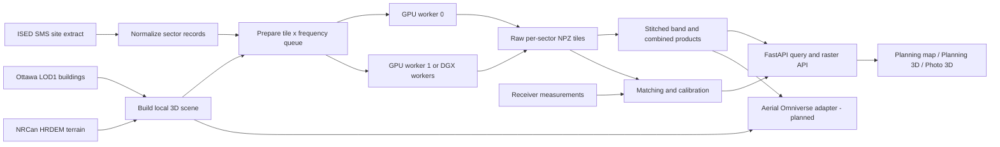

# Ottawa Sionna RT Wireless Infrastructure Digital Twin

## Technical handover guide

**Location:** 350 Legget Drive testbed, Kanata, Ottawa, Canada  
**Anchor:** `45.340455200216, -75.91114196736`  
**Repository:** `Sionna_RT_OTTAWA`  
**Document status:** current implementation, checked 2026-09-25

This document is the starting point for a team taking ownership of the application. It explains the data, RF model, processing pipeline, deployment model, user interface, calibration workflow, and the intended path to NVIDIA Aerial Omniverse Digital Twin (AODT). It also states the important scientific and operational limitations so that a demonstration result is not mistaken for a network guarantee.

Related operator references:

- [README.md](README.md) — project overview and short command reference.
- [docs/operations.md](docs/operations.md) — copy-and-paste operating runbook.
- [docs/configuration.md](docs/configuration.md) — YAML configuration reference.
- [RUN_GUI_GUIDE_FOR_NON_TECHNICALS.md](RUN_GUI_GUIDE_FOR_NON_TECHNICALS.md) — GUI-only instructions.

### Contents

- System and foundations: Sections 1–7 cover scope, current artifacts, Sionna, data sources, formats, tools, and coordinate conventions.
- Running the system: Sections 8–13 cover the pipeline, RF calculations, configuration, Docker/DGX, API/GUI, and measurement calibration.
- Using and transferring it: Sections 14–22 cover result interpretation, Aerial Omniverse integration, release controls, troubleshooting, governance, limitations, the handover checklist, glossary, and references.

---

## 1. What the application does

The application builds a reproducible outdoor cellular-propagation model around the Legget Drive testbed. It combines:

1. public terrain and building geometry;
2. public ISED records describing licensed mobile transmitters and antenna sectors;
3. NVIDIA Sionna RT radio-propagation simulation;
4. a durable tile/frequency job queue for one or more GPUs;
5. stitched coverage products and coordinate queries;
6. a FastAPI service and 2D/3D browser interface; and
7. a measurement-ingestion and calibration workflow for future receiver-node readings.

The primary outputs are outdoor estimates of:

- propagation path gain;
- received signal strength (RSS);
- reference signal received power (estimated RSRP);
- signal-to-interference-plus-noise ratio (SINR);
- strongest sector and frequency group; and
- confidence/provenance flags.

The output is a planning estimate. It does not model network scheduling, traffic load, handover policy, carrier aggregation, indoor penetration, device implementation, or a mobile operator's commercial service policy.

### System flow



---

## 2. Current checked-in data and run status

Generated data is intentionally ignored by Git. The following describes the `data/` tree present when this handover was written; a new host must receive that tree separately or rebuild it.

### Public-data snapshot

- Snapshot retrieval date: 2026-09-17.
- ISED normalized records: 812 sector-frequency records.
- Records with at least one explicit fallback: 111.
- Exact ISED transmit frequencies represented: 75, from 619.5 to 3840 MHz.
- Simulation frequency groups after 5 MHz bucketing: 56.
- Public contact fields contained in the source extract are not retained by the normalizer.

### Built scenes

| Scene | Output width | Context per side | Buildings | Total triangles |
| --- | ---: | ---: | ---: | ---: |
| `legget-2000m` | 2 km | 2 km | 14,321 | 2,198,554 |
| `legget-4000m` | 4 km | 1 km | 14,321 | 2,198,554 |
| `legget-6000m` | 6 km | 750 m | 16,504 | 2,266,062 |

### Completed demonstration runs

| Run | Area | Cell | Frequency groups | Jobs | Status |
| --- | ---: | ---: | ---: | ---: | --- |
| `demo-1940mhz-overnight-20260917` | 2 km | 10 m | 1 | 4/4 | Complete |
| `demo-4km-multiband-20260918` | 4 km | 10 m | 9 | 144/144 | Complete |
| `demo-4km-5m-multiband-20260918` | 4 km | 5 m | 9 | 576/576 | Complete |
| `demo-6km-2p5m-multiband-20260918-r2` | 6 km | 2.5 m | 56 | 8,064/8,064 | Complete |

The 4 km/5 m run completed in approximately 553 seconds on two RTX 3070 GPUs. Treat that as a result for that machine, scene, and profile—not a general throughput guarantee. The 6 km run's queue is complete, but its directory should be checked for a complete `finalization.json` before it is treated as an archival release. Running `finalize` again is safe after confirming that pending, processing, and failed counts are zero.

---

## 3. What Sionna is

[NVIDIA Sionna](https://nvlabs.github.io/sionna/) is an open-source, GPU-accelerated library for communications research. This project uses the separately packaged [Sionna RT 2.1.0](https://nvlabs.github.io/sionna/rt/index.html), which is a differentiable ray tracer for radio propagation.

Sionna RT is built on [Mitsuba 3](https://mitsuba.readthedocs.io/en/stable/) and [Dr.Jit](https://drjit.readthedocs.io/en/latest/). Mitsuba provides scene and ray-intersection machinery. Dr.Jit compiles vectorized calculations for CPU or CUDA execution and supports automatic differentiation. Sionna RT adds radio materials, antennas, propagation interactions, channel calculations, path solvers, and radio-map solvers.

The official [Sionna RT introduction](https://nvlabs.github.io/sionna/rt/tutorials/Introduction.html) describes radio maps as a metric such as path gain, RSS, or SINR assigned to receiver cells for each transmitter. That is the main Sionna capability used here.

### What Sionna does in this project

For every tile and frequency group, the application:

1. loads a Mitsuba XML scene containing terrain and building meshes;
2. sets the carrier frequency and representative bandwidth;
3. adds the relevant ISED sectors as transmitters;
4. loads a terrain-draped receiver mesh at the configured height above ground;
5. invokes Sionna RT's `RadioMapSolver` with deterministic settings;
6. receives per-transmitter path-gain values over the receiver surface; and
7. converts path gain into RSS, RSRP, SINR, and strongest-server layers using ISED power and antenna attributes.

The supplied production-style profiles enable line of sight, specular reflection, refraction/transmission, and diffraction. Diffuse reflection and edge diffraction are disabled because of their cost. The current high-resolution profiles use one million samples per transmitter and maximum interaction depth four.

### What Sionna does not do here

- The current radio-map jobs do not save individual ray polylines. They save aggregate path gain per transmitter and receiver cell. A future path-inspection workflow should use Sionna's `PathSolver` for selected transmitter/receiver pairs.
- The current scene does not use the streamed Google Photorealistic 3D Tiles. Those are a visual backdrop only.
- Sionna does not read the ISED extract directly. The application normalizes and validates it first.
- Sionna produces path gain with each transmitter set to 0 dBm. The application applies ISED power, line loss, gain, and the parameterized sector pattern afterward.
- The application currently uses a one-element isotropic vertical-polarization Sionna transmit array. Detailed manufacturer antenna/array patterns are not yet present.

---

## 4. Data sources, links, licences, and uses

The authoritative record of the exact downloaded files is `data/raw/provenance.json`. It includes retrieval timestamps, source URLs, byte sizes, SHA-256 checksums, licences, and source-specific metadata. Never replace that manifest by copying only the files.

### 4.1 ISED Spectrum Management System

**Source:** Innovation, Science and Economic Development Canada (ISED)  
**Dataset:** Terrestrial Spectrum Licence Site Data Extract  
**Links:**

- [ISED SMS data download page](https://ised-isde.canada.ca/site/spectrum-management-system/en/spectrum-management-system-data/download-sms-data)
- [Direct terrestrial site extract ZIP used by the application](https://www.ic.gc.ca/engineering/SMS_TAFL_Files/Site_Data_Extract_FX.zip)
- [ISED field descriptions](https://ised-isde.canada.ca/site/spectrum-management-system/sites/default/files/documents/Field%20Descriptions%20-%20Descriptions%20des%20champs_0.pdf)
- [Open Government Licence – Canada](https://open.canada.ca/en/open-government-licence-canada)

**Raw format:** ZIP containing one UTF-8 CSV.  
**Local snapshot:** `data/raw/ised/Site_Data_Extract_FX.zip`.  
**Use:** site/sector position, licensee/operator, technology text, cell/physical identity when present, transmit frequency, bandwidth, transmit power, antenna height, gain, line loss, azimuth, elevation angle/downtilt, horizontal and vertical beamwidth, and omnidirectional flag.

The ISED extract describes authorized/reported installations. It is not live operational telemetry and does not guarantee that every record is on air, configured exactly as filed, carrying traffic, or marketed as service at the time of a simulation.

### 4.2 City of Ottawa 3D Buildings LOD1

**Source:** City of Ottawa Open Data  
**Dataset:** 3D Buildings LOD1 neighbourhood packages  
**Links:**

- [ArcGIS FeatureServer index used for package discovery](https://services.arcgis.com/G6F8XLCl5KtAlZ2G/arcgis/rest/services/3D_Buildings_LOD1/FeatureServer/0)
- [City of Ottawa Open Data information](https://ottawa.ca/en/city-hall/open-transparent-and-accountable-government/open-data/about-open-data)
- [City of Ottawa open-data licence information](https://ottawa.ca/en/city-hall/open-transparent-and-accountable-government/open-data/open-data-license-change-faq)

**Raw format:** neighbourhood ZIP files containing Esri File Geodatabases.  
**Local snapshot:** `data/raw/ottawa_lod1/*.gdb.zip`.  
**Use:** building footprints and LOD1 heights. The scene builder reads Esri MultiPatch faces through Fiona/GDAL, unions XY surfaces into footprints, and extrudes a simplified building envelope from sampled terrain to the reported height.

LOD1 means block-like massing. It does not include façade details, windows, roof equipment, interiors, street furniture, individual trees, or reliable material classes.

### 4.3 NRCan High Resolution Digital Elevation Model

**Source:** Natural Resources Canada, CanElevation Series  
**Dataset:** High Resolution Digital Elevation Model (HRDEM), LiDAR-derived DTM  
**Links:**

- [HRDEM open-data record and product specification](https://open.canada.ca/data/en/dataset/957782bf-847c-4644-a757-e383c0057995)
- [Geo.ca STAC API used for discovery](https://datacube.services.geo.ca/stac/api/search)
- [Open Government Licence – Canada](https://open.canada.ca/en/open-government-licence-canada)

**Raw format:** cloud-optimized GeoTIFF DTM, clipped to the project bounds.  
**Local snapshot:** `data/raw/terrain/dtm.tif`.  
**Use:** terrain surface, local scene origin elevation, building base elevation, transmitter base elevation, and receiver-surface elevation.

The project uses the terrain model plus heights above ground level. Do not mix WGS84 ellipsoidal heights with the DTM's orthometric elevations without an explicit vertical transformation.

### 4.4 Cesium ion and Google Photorealistic 3D Tiles

**Sources:** Cesium ion and Google Maps Platform  
**Links:**

- [Cesium ion documentation](https://cesium.com/learn/ion/)
- [Google Photorealistic 3D Tiles renderer guidance](https://developers.google.com/maps/documentation/tile/use-renderer)
- [Google Map Tiles API policies and attribution requirements](https://developers.google.com/maps/documentation/tile/policies)

**Format:** streamed OGC 3D Tiles/glTF content.  
**Use:** Photo 3D browser visualization only.

This source is intentionally excluded from reproducible RF scene construction. The application may overlay its own results on the streamed tiles, but it must not extract, trace, derive geometry from, bulk-download, or rehost Google's tiles. Required Cesium/Google attribution must remain visible. Normal service-controlled HTTP/browser caching is allowed; building an offline 10 km cache of Google content is not.

### 4.5 Cesium World Terrain and OpenStreetMap buildings

Planning 3D can use Cesium World Terrain and Cesium OSM Buildings for visual context. [OpenStreetMap attribution and licence information](https://www.openstreetmap.org/copyright) applies when its data is displayed. These layers are not the canonical propagation geometry; the licensed Ottawa LOD1 and NRCan snapshot is.

---

## 5. Data formats and artifact contracts

| Format | Where used | Notes |
| --- | --- | --- |
| YAML | `config/*.yaml`, AODT future configs | Human-authored project settings. Preserve the exact config used by a run. |
| ZIP + CSV | raw ISED extract | Monthly source snapshot; do not edit in place. |
| ZIP + Esri File GDB | Ottawa LOD1 packages | Source building geometry. |
| GeoTIFF | HRDEM DTM | Raster terrain elevation with CRS metadata. |
| JSON | manifests, summaries, job records, calibration model | Indented or compact structured metadata. |
| JSON Lines (`.jsonl`) | normalized sectors, measurements, calibration baseline | One independent JSON object per line; streamable and append-friendly. |
| GeoJSON | building preview and API station/measurement features | Visualization/interchange, not the ray-tracing mesh. |
| PLY | terrain, buildings, receiver surfaces | Triangle meshes consumed by Mitsuba/Sionna. |
| Mitsuba XML | `scene.xml` | Scene entry point, mesh references, and radio-material assignment. |
| NumPy NPZ | tile and stitched RF arrays | Compressed numerical artifact. Load with `allow_pickle=False`. |
| PNG | engineering figures and browser coverage cache | Derived visualization; can always be regenerated from NPZ. |
| CSV | incoming receiver measurements | Human/system interchange before validation to JSONL. |
| HTML/CSS/JS | compiled browser application | `web/dist`, served by FastAPI. |
| OpenUSD/3D Tiles/Parquet/HDF5 | planned AODT integration | Not produced by the current application; see Section 15. |

### Data tree

```text
data/
  raw/
    provenance.json
    ised/Site_Data_Extract_FX.zip
    ottawa_lod1/*.gdb.zip
    terrain/dtm.tif
  processed/
    sectors.jsonl
    sectors.summary.json
    benchmark.json
  scenes/
    legget-<width>m/
      scene.xml
      scene_metadata.json
      buildings.geojson
      meshes/terrain.ply
      meshes/buildings.ply
  runs/
    <run-id>/
      run.json
      surfaces/*.ply and *.npz
      queue/{pending,processing,done,failed}/*.json
      tiles/*.npz
      stitched/<frequency>MHz.npz
      stitched/all-bands.npz
      stitched/stitch-report.json
      cache/coverage/*.png
      visualization/*-summary.png
      visualization/visualization-report.json
      finalization.json
  measurements/*.jsonl
  calibration/*.json
```

### Stable application records

`SectorRecord`, `ReceiverMeasurement`, `SectorPrediction`, and `ServicePrediction` are defined in `src/ottawa_rt/models.py` and validated with Pydantic. Treat them as interface contracts. If fields are renamed or their units change, increment the relevant schema/model version and provide a migration.

---

## 6. Libraries and tools

Exact Python dependencies are pinned in `pyproject.toml`; frontend dependencies are locked in `web/pnpm-lock.yaml`.

### RF and rendering

- `sionna-rt==2.1.0` — radio propagation and radio-map solver.
- Mitsuba 3 — scene loading and geometric ray intersection, installed through Sionna RT.
- Dr.Jit — CUDA/CPU just-in-time compiled numerical backend, installed through Sionna RT.
- NVIDIA CUDA runtime 12.8.1 in the container.

### Geospatial and mesh processing

- Fiona and GDAL — File Geodatabase access.
- GeoPandas, Pyogrio, and Shapely — geometry manipulation and spatial records.
- PyProj — WGS84/NAD83 UTM coordinate transforms.
- Rasterio — GeoTIFF clipping, reprojection, resampling, and terrain sampling.
- Trimesh — PLY mesh creation and inspection.

### Application and numerical processing

- Python 3.11 (3.12 is also accepted by the project metadata).
- NumPy — RF arrays and NPZ artifacts.
- Pandas, SciPy, scikit-learn — analysis/calibration support.
- Matplotlib and Pillow — engineering figures and coverage PNGs.
- Pydantic — data validation.
- Typer — command-line interface.
- FastAPI and Uvicorn — read-only API and static web serving.

### Browser application

- React 19 and TypeScript.
- CesiumJS — globe, terrain, OSM buildings, and photorealistic 3D Tiles.
- MapLibre GL — planning map.
- deck.gl — high-performance overlays.
- Vite and pnpm — build and package management.

### Packaging and execution

- Docker / Docker Compose — immutable runtime and local two-GPU profile.
- NVIDIA Container Toolkit — makes selected GPUs visible inside Linux containers. See the official [installation guide](https://docs.nvidia.com/datacenter/cloud-native/container-toolkit/install-guide.html) and [GPU selection documentation](https://docs.nvidia.com/datacenter/cloud-native/container-toolkit/latest/docker-specialized.html).
- WSL2 — supported development/demo host when the Windows NVIDIA driver and Docker GPU integration are working.
- DGX/MIG — one worker container per visible device.
- SLURM — optional one-GPU array jobs using the same shared filesystem queue.

---

## 7. Coordinate and height conventions

Getting the coordinate model wrong can invalidate every RF result.

- External positions and API inputs are WGS84 decimal degrees (`EPSG:4326`).
- Scene construction uses NAD83 / UTM Zone 18N (`EPSG:26918`) in metres.
- Mesh vertices are stored relative to a scene-local UTM origin near the anchor to maintain numerical precision.
- The local origin elevation is sampled from the NRCan DTM.
- ISED antenna height is interpreted as metres above local ground level (AGL).
- Transmitter Z is `terrain elevation at site + antenna height AGL`.
- Receiver Z is `terrain elevation at cell + configured receiver height AGL`.
- The default receiver height is 1.5 m AGL.

The saved tile metadata identifies the vertical convention as `NRCan DTM orthometric elevation plus receiver AGL`.

Important current behavior: coordinate queries read a precomputed map at the run's receiver height. Although the API accepts `height_agl_m`, it does not retrace or interpolate a different-height map. Until multi-height products are implemented, a requested height should be treated as query metadata unless it matches the run configuration.

---

## 8. End-to-end program operation

All commands are exposed by `ottawa-rt` and implemented in `src/ottawa_rt/cli.py`. Use the same `--config` file for acquisition, scene building, simulation, finalization, querying, and serving.

### 8.1 Acquire and snapshot public data

```powershell
python -m ottawa_rt.cli fetch-data `
  --config config/demo-6km-2p5m.yaml `
  --width-m 6000
```

The acquisition extent is the output width plus `area.context_m` on every side. The command:

1. downloads the ISED ZIP;
2. queries the Ottawa ArcGIS index for intersecting neighbourhood packages;
3. downloads those File Geodatabases;
4. searches NRCan's STAC collection for an Ottawa HRDEM DTM;
5. clips the terrain raster; and
6. writes or updates `data/raw/provenance.json` with SHA-256 checksums.

Use `--force` only for an intentional refresh. A refreshed source snapshot requires a new model version and run ID.

### 8.2 Normalize ISED sectors

```powershell
python -m ottawa_rt.cli normalize-ised `
  --config config/demo-6km-2p5m.yaml `
  --width-m 6000
```

The normalizer:

- strips ISED's trailing `*` header annotations;
- retains rows within the configured bounding box;
- keeps technology text containing LTE, 5G, NR, UMTS, HSPA, GSM, or CDMA;
- requires a transmit frequency;
- parses RF and antenna fields into `SectorRecord`;
- removes duplicate stable sector IDs; and
- substitutes configured defaults only when a field is missing/invalid, recording every substitution in `defaults_applied`.

The output is `data/processed/sectors.jsonl` plus a summary JSON.

### 8.3 Build the scene

```powershell
python -m ottawa_rt.cli build-scene `
  --config config/demo-6km-2p5m.yaml `
  --width-m 6000
```

The scene builder:

1. transforms source geometry into EPSG:26918;
2. creates a terrain mesh from the DTM, currently resampled to a practical mesh spacing;
3. creates LOD1 building envelopes from MultiPatch/footprint geometry and height attributes;
4. samples terrain for building bases;
5. subtracts the local scene origin;
6. writes terrain/building PLY files and a Mitsuba XML scene; and
7. writes `scene_metadata.json` and `buildings.geojson`.

The current scene assigns `ground` to terrain and `concrete` to building envelopes. Glass, metal, vegetation, and water profiles exist in configuration but are not yet spatially classified and assigned to separate geometry.

### 8.4 Benchmark and select a safe area

Every complete scene must fit in the memory of one worker's selected GPU or MIG partition. GPU memory is not pooled.

```powershell
python -m ottawa_rt.cli benchmark `
  --config config/demo-6km-2p5m.yaml `
  --seconds-per-tile-band <measured-seconds> `
  --scene-vram-gb <measured-peak-gb> `
  --measured-width-m 6000 `
  --band-count 56
```

Measure a representative production-settings tile on the target GPU. The benchmark estimator applies the configured 90% VRAM ceiling and total runtime budget. Re-run it when moving from RTX hardware to DGX/A100/H100/L40S or changing MIG partition size.

### 8.5 Prepare the durable queue

```powershell
python -m ottawa_rt.cli simulate `
  --config config/demo-6km-2p5m.yaml `
  --width-m 6000 `
  --run-id ottawa-6km-2p5m-YYYYMMDD
```

The command selects potentially receivable sectors, creates terrain-draped receiver surfaces, and writes one queue job per tile and frequency group.

```text
tile_count = ceil(output_width / tile_core_size)^2
job_count  = tile_count x frequency_group_count
```

A free-space upper-bound test includes off-area transmitters that could exceed `min_free_space_rx_dbm` at an output corner or the anchor. This avoids an arbitrary site-distance cutoff while limiting clearly irrelevant transmitters.

### 8.6 Execute workers

Local two-GPU execution can be launched by `simulate --execute`, or manually:

```powershell
$env:CUDA_VISIBLE_DEVICES = '0'
python -m ottawa_rt.cli worker ottawa-6km-2p5m-YYYYMMDD `
  --config config/demo-6km-2p5m.yaml
```

Run a second terminal with device `1`. Each worker atomically renames one job from `pending` to `processing`, computes it, writes the NPZ tile, and moves the record to `done` or `failed`. Completed jobs are not repeated when workers restart.

After an unclean stop, do not blindly move all `processing` files. Read `claimed_by`, confirm the recorded host/PID is dead, and return only genuinely stale jobs to `pending`.

### 8.7 Stitch, validate seams, and render

```powershell
python -m ottawa_rt.cli finalize ottawa-6km-2p5m-YYYYMMDD `
  --config config/demo-6km-2p5m.yaml
```

Stitching removes the overlap from final ownership: each output cell belongs to one deterministic tile core. Overlaps are compared to produce seam MAE, P95, and maximum error diagnostics. It creates one full-area NPZ per frequency plus `all-bands.npz`, then renders reference figures.

The combined product is a presentation overview, not carrier aggregation. Each metric array is independently maximized across simulated bands. The saved serving sector and winning frequency are selected by strongest RSRP. Consequently, a combined SINR maximum may come from a different band than the saved RSRP-serving identity.

### 8.8 Query and serve

```powershell
python -m ottawa_rt.cli query `
  --config config/demo-6km-2p5m.yaml `
  --latitude 45.3404552 `
  --longitude -75.9111420 `
  --run-id demo-6km-2p5m-multiband-20260918-r2

python -m ottawa_rt.cli serve `
  --config config/demo-6km-2p5m.yaml `
  --host 127.0.0.1 `
  --port 8000
```

The query service reads the raw per-sector tile covering the coordinate, ranks sectors by RSRP, and applies the configured service threshold. If no completed tile covers the point, it returns a clearly flagged low-confidence free-space preview.

---

## 9. How frequencies, ray directions, power, and RF metrics are calculated

This section describes the implementation, not a generic cellular model.

### 9.1 Frequency selection

ISED supplies `tx_frequency` in MHz and, where available, channel bandwidth. The application groups sectors for simulation with:

```text
frequency_group_mhz = round(tx_frequency_mhz / 5) x 5
```

Each group is traced separately at the grouped carrier. Exact ISED frequencies remain stored in each sector and tile. Grouping reduces duplicate traces for nearby carriers, but it is an approximation. A scientific release requiring exact-carrier differences should change this policy, increment the model version, and rerun.

Sionna scene bandwidth is the median available sector bandwidth in the group. Per-sector RSRP conversion and thermal-noise calculation use that sector's own bandwidth when available; otherwise they use the representative bandwidth.

### 9.2 Sector position and orientation

Sector latitude/longitude is transformed to local UTM XY. Transmitter Z is local terrain plus ISED antenna height AGL.

Azimuth uses north as 0 degrees and clockwise rotation. The transmitter orientation target is constructed as:

```text
x_target = x + sin(azimuth) x 1000
y_target = y + cos(azimuth) x 1000
z_target = z - tan(downtilt) x 1000
```

This orients the Sionna transmitter consistently with the ISED azimuth/downtilt.

### 9.3 How ray directions are determined

The application does not calculate one fixed ray from a transmitter to every grid cell. `RadioMapSolver` samples propagation directions from each transmitter using Sionna's solver algorithm, the configured `samples_per_tx`, the configured deterministic seed, the scene geometry, maximum interaction depth, and enabled propagation mechanisms. The current worker passes the same configured seed to every tile job. Rays are intersected with terrain/building surfaces and contribute energy to triangles of the terrain-draped measurement surface.

The number of samples controls Monte Carlo coverage and noise; it is not the number of unique final paths. The deterministic seed makes repeated jobs comparable within numerical tolerance. See the official [RadioMapSolver API](https://nvlabs.github.io/sionna/rt/api/radio_map_solvers.html) for the solver's current parameters.

### 9.4 Antenna pattern approximation

The Sionna trace currently uses an isotropic single-element vertical-polarization transmitter. The application then applies an ISED-derived directional gain to every transmitter/receiver cell using quadratic horizontal and vertical cuts:

```text
horizontal_loss_db = 12 x (azimuth_error / horizontal_beamwidth)^2
vertical_loss_db   = 12 x (elevation_error / vertical_beamwidth)^2
attenuation_db     = min(horizontal_loss_db + vertical_loss_db, front_to_back_db)
pattern_gain_dbi   = ISED_gain_dbi - attenuation_db
```

Default front-to-back attenuation is 30 dB. This is useful when manufacturer pattern files are unavailable, but it is not a full active-antenna, beamforming, polarization, or side-lobe model.

### 9.5 Power accounting

ISED supplies transmit power, antenna gain, and line loss where available. The normalized effective isotropic radiated power is:

```text
EIRP_dBm = tx_power_dBm + antenna_gain_dBi - line_loss_dB
```

The solver transmitter is deliberately set to 0 dBm so its output is path gain. The application then computes each sector's received signal strength:

```text
RSS_dBm = path_gain_dB
        + tx_power_dBm
        - line_loss_dB
        + pattern_gain_dBi
```

If an ISED value is missing or outside configured validity bounds, a configurable fallback is used and written to `defaults_applied`. Current defaults include 43 dBm transmit power, 15 dBi gain, 2 dB line loss, 25 m antenna height, 65/10 degree beamwidths, and 4 degree downtilt. They are not silent assumptions.

### 9.6 RSRP estimate

The implementation approximates the number of resource elements using a bandwidth-to-resource-block lookup and calculates:

```text
RSRP_dBm = RSS_dBm - 10 log10(resource_blocks x 12)
```

This is a planning approximation. The resource-block lookup spans LTE-like and wideband values and does not model an operator's actual numerology, reference-signal pattern, occupied bandwidth, or scheduling.

### 9.7 Noise and SINR

Thermal noise is:

```text
noise_dBm = -174 + 10 log10(bandwidth_Hz) + receiver_noise_figure_dB
```

The default receiver noise figure is 7 dB. Within one 5 MHz frequency group, every modeled sector is treated as an always-on potential interferer:

```text
SINR_i = signal_i / (sum(other same-group signals) + noise)
```

The ratio is converted to dB. There is no traffic loading, time/frequency scheduling, coordination, beam scheduling, or inter-band interference. A high/low SINR region should therefore be presented as comparative geometry-dependent behavior under the model assumptions.

### 9.8 Material behavior

The XML scene uses Sionna/ITU radio-material families. Current public geometry distinguishes medium dry ground and concrete building envelopes. Material constitutive parameters depend on frequency. For sub-GHz frequencies outside the valid lower range of some Sionna 2.1 ITU-R P.2040 fits, the carrier remains at its real frequency while unsupported material parameters are frozen at the nearest valid boundary. Each affected tile records this in `material_frequency_fallbacks`.

---

## 10. Configuration and reproducibility rules

Project profiles live under `config/`:

| Profile | Area | Cell | Tile core | Context | Depth | Purpose |
| --- | ---: | ---: | ---: | ---: | ---: | --- |
| `default.yaml` | benchmark-selected 2–12 km | 5 m | 1 km | 2 km | 5 | Baseline sizing |
| `demo-overnight.yaml` | 2 km | 10 m | 1 km | 2 km | 4 | Small demo |
| `demo-4km.yaml` | 4 km | 10 m | 1 km | 1 km | 4 | Lower-resolution demo |
| `demo-4km-5m.yaml` | 4 km | 5 m | 500 m | 1 km | 4 | High-resolution representative bands |
| `demo-6km-2p5m.yaml` | 6 km | 2.5 m | 500 m | 750 m | 4 | Highest-resolution all-group run |
| `sionna-gui.yaml` | N/A | N/A | N/A | N/A | 5 | Technical scene inspection handoff; not a CLI project profile |

Rules:

1. Copy the closest profile instead of editing a completed run's profile in place.
2. Change `project.model_version` when any scientific assumption changes.
3. Use a new run ID after changing source data, scene, width, resolution, receiver height, materials, antenna defaults, frequency policy, solver mechanisms, depth, or samples.
4. Preserve the exact YAML with the released run. The current `run.json` captures many settings, but the YAML remains the full configuration contract.
5. Do not mix smoke-test worker overrides into a production queue.
6. Keep the raw provenance manifest, scene metadata, run manifest, raw tiles, stitched products, and calibration model together.

---

## 11. Docker design and operation

### 11.1 Image construction

`Dockerfile` is a multi-stage build:

1. `python:3.11.14-slim-bookworm` supplies the pinned Python runtime.
2. `node:22-bookworm-slim` installs pnpm 11.19, restores the locked web dependencies, and builds `web/dist`.
3. `nvidia/cuda:12.8.1-runtime-ubuntu24.04` is the final runtime. It installs required system/GDAL libraries, installs the Python project with all runtime extras, verifies that `sionna.rt` imports, then copies the configuration and compiled web application.

The image entry point is `ottawa-rt`; its default command starts the API on port 8000.

The image intentionally excludes `data/`, local environments, tokens, and generated web output through `.dockerignore`. Runtime data is mounted from the host so queues and results survive container replacement and can move between WSL2 and DGX.

### 11.2 Build and GPU smoke test

On Linux/WSL/DGX, install Docker and the NVIDIA Container Toolkit, then verify:

```bash
nvidia-smi
docker run --rm --gpus all nvidia/cuda:12.8.1-runtime-ubuntu24.04 nvidia-smi
docker compose build
```

The host NVIDIA driver must support the CUDA version required by the image. CUDA user-space libraries are inside the container; the kernel driver remains on the host.

### 11.3 Local two-GPU Compose profile

`compose.yaml` defines:

- `api`: port 8000, `./data:/app/data`, no GPU required for serving existing results;
- `worker-0`: GPU 0 and the same data mount; and
- `worker-1`: GPU 1 and the same data mount.

Build the frontend with the optional Cesium settings:

```bash
export VITE_CESIUM_ION_TOKEN='restricted-token'
export VITE_CESIUM_ENABLE_PHOTOREALISTIC=true
docker compose --profile local build
```

Prepare, execute, finalize, and serve:

```bash
docker compose run --rm api simulate \
  --config config/demo-4km-5m.yaml \
  --width-m 4000 \
  --run-id ottawa-4km-5m-YYYYMMDD

RUN_ID=ottawa-4km-5m-YYYYMMDD \
  docker compose --profile local up worker-0 worker-1

docker compose run --rm api finalize \
  ottawa-4km-5m-YYYYMMDD \
  --config config/demo-4km-5m.yaml

docker compose --profile local up api
```

### 11.4 DGX and MIG

```bash
scripts/run-dgx-workers.sh ottawa-4km-5m-YYYYMMDD ottawa-sionna-rt:latest
```

The script searches for visible MIG UUIDs first; if none exist, it uses physical GPU UUIDs. It launches one container per device, presents that selected device as CUDA device 0 inside the container, mounts `data/`, and writes worker logs under the run directory.

Do not assume NVLink or aggregate VRAM. Every worker independently loads the common scene, and every job must fit one physical GPU or MIG partition. A DGX can increase concurrency and may support larger scenes, but it does not automatically make one Sionna process use all GPU memory.

### 11.5 SLURM

```bash
sbatch --array=0-7 scripts/slurm-worker.sh \
  ottawa-4km-5m-YYYYMMDD \
  ottawa-sionna-rt:latest
```

Each array task requests one GPU, eight CPUs, 64 GB host memory, and 12 hours. All tasks must see the same mounted `data/` directory, and that filesystem must provide reliable atomic rename semantics for queue claims.

---

## 12. API and browser GUI

### 12.1 API

The API is read-only and implemented in `src/ottawa_rt/api.py`.

| Endpoint | Purpose |
| --- | --- |
| `GET /health` | Service status and model version |
| `GET /v1/project` | Anchor, area, receiver, and disclaimer |
| `GET /v1/query` | Ranked service prediction at a coordinate |
| `GET /v1/stations` | Filtered station/sector GeoJSON |
| `GET /v1/runs` | Run manifests and available coverage products |
| `GET /v1/provenance` | Public-data manifest |
| `GET /v1/calibration` | Latest calibration model/report |
| `GET /v1/measurements` | Latest measurement GeoJSON |
| `GET /v1/coverage/{run}/{file}` | JSON, metadata, or PNG coverage |
| `GET /v1/scenes/{scene}/buildings` | Ottawa LOD1 preview GeoJSON |

Interactive OpenAPI documentation is at `/docs`.

Coverage PNGs are generated lazily from NPZ arrays into `data/runs/<run>/cache/coverage`. Their URL includes a source-derived version and the server returns immutable cache headers, so subsequent views do not re-encode the same raster. Delete only the cache directory—not the NPZ source—when intentionally changing the renderer or colour scale.

### 12.2 Browser modes

- **Planning map:** MapLibre/deck.gl engineering view.
- **Planning 3D:** Cesium terrain/OSM context plus reproducible Ottawa scene previews.
- **Photo 3D:** Google Photorealistic 3D Tiles streamed through Cesium ion, with Sionna coverage overlaid as a translucent analysis surface.

Photo 3D improves presentation, not the RF model. The overlay display height/opacity is a visualization choice and does not change the 1.5 m AGL receiver grid saved in the run.

### 12.3 Cesium token

For source development:

```powershell
Copy-Item web/.env.example web/.env.local
```

Add:

```dotenv
VITE_CESIUM_ION_TOKEN=your_restricted_token
VITE_CESIUM_ENABLE_OSM_BUILDINGS=true
VITE_CESIUM_ENABLE_PHOTOREALISTIC=true
VITE_CESIUM_TILE_CACHE_MB=1024
VITE_CESIUM_TILE_CACHE_OVERFLOW_MB=512
```

Then rebuild the web app. Vite variables are compiled into the browser bundle, so the token is not a server-side secret. Restrict it in Cesium ion to the minimum assets/URLs and rotate it if exposed. Never commit `web/.env.local`, place it in a ZIP, or record it in run artifacts.

---

## 13. Receiver measurements and calibration

The expected CSV header is shown in `examples/receiver-measurements.csv`:

```text
timestamp,latitude,longitude,height_agl_m,frequency_mhz,operator,cell_id,physical_cell_id,rsrp_dbm,rssi_dbm,rsrq_db,sinr_db
```

Position, frequency, timestamp, and at least one of RSRP/RSSI are required. The current fitting objective requires RSRP. Operator, cell ID, and PCI greatly improve matching quality.

```powershell
python -m ottawa_rt.cli import-measurements receiver-readings.csv `
  --config config/demo-6km-2p5m.yaml

python -m ottawa_rt.cli calibrate data/measurements/receiver-readings.jsonl `
  --config config/demo-6km-2p5m.yaml `
  --run-id demo-6km-2p5m-multiband-20260918-r2
```

### Matching

A measurement candidate must be within frequency tolerance and 30 km. The score then considers frequency difference, distance, operator, cell ID, PCI, and bearing relative to sector azimuth/beamwidth. If the two best scores are within 2 points, the measurement is marked ambiguous and excluded from fitting by default.

### Spatial split

Measurements are assigned by spatial block to train/validation/test in a deterministic 60/20/20 split. This prevents nearby samples from leaking across partitions and overstating generalization.

### Current calibration model

The implemented calibration is robust staged dB correction:

1. median global receiver/device offset;
2. shrunken median frequency-range offsets; and
3. regularized per-sector offsets clipped to ±6 dB.

It reports count, MAE, RMSE, bias, P90 absolute error, and service-threshold accuracy for the three splits.

The current code does not yet optimize material/scattering parameters by retracing Sionna. That remains a future stage once real, sufficiently diverse measurements exist. Preserve raw per-sector tiles so new calibration methods can be evaluated without rebuilding geometry.

---

## 14. How the results should be used

### Engineering use

- compare propagation differences across frequencies;
- identify predicted outdoor weak-signal and interference regions;
- rank candidate sectors at a coordinate;
- inspect the effect of sector orientation, terrain, and building blockage;
- compare uncalibrated and calibrated estimates against receiver-node readings;
- prioritize locations for field measurements; and
- provide repeatable baseline data for another digital-twin system.

### Demonstration use

Use **Combined RSRP** for the most visually continuous overview, then show a low-band RSRP layer near 890 MHz and a mid/high-band layer near 2655 or 3505 MHz to explain propagation/capacity tradeoffs. Explicitly label Combined as “best simulated band at each cell,” not aggregate service or carrier aggregation.

### Uses to avoid

- promising commercial coverage or throughput;
- claiming the ISED extract is a live operational network inventory;
- treating estimated RSRP as protocol-perfect measurement;
- comparing separate frequency layers without noting different transmitter counts and bandwidths;
- using the photorealistic display geometry as proof of traced geometry; or
- applying calibration offsets outside the measured device, area, band, and time context without validation.

---

## 15. NVIDIA Aerial Omniverse Digital Twin integration

The name is **NVIDIA Aerial Omniverse Digital Twin (AODT)**. Current official documentation is at [AODT 1.5](https://docs.nvidia.com/aerial/aodt/v1.5.0/welcome). AODT is a separate product and simulation stack; this repository does not currently contain an AODT connector.

AODT provides scene building, EM and RAN simulations, an interactive viewer, calibration, and structured results. Its current [GIS pipeline](https://docs.nvidia.com/aerial/aodt/v1.5.0/scene-building) accepts OpenStreetMap or CityGML inputs and prepares simulation/viewer assets. Its [results workflow](https://docs.nvidia.com/aerial/aodt/results-and-data) exports structured Parquet tables to S3-compatible storage and an Iceberg catalog; optional RAN waveform dumps are HDF5. Its [configuration builder](https://docs.nvidia.com/aerial/aodt/v1.5.0/configuring-sim-yaml) defines DUs, RUs, UEs, panels, timelines, storage, and result tables.

### 15.1 Recommended integration boundary

Keep the current Ottawa application as the public-data ingestion, provenance, and baseline Sionna planning pipeline. Add a separate, versioned exporter rather than modifying raw artifacts in place.

Recommended exporter products:

1. **Scene package:** convert the licensed Ottawa LOD1/HRDEM scene to AODT-supported CityGML or an AODT GIS task input. Preserve EPSG, vertical reference, bounds, material labels, and source provenance.
2. **AODT scenario YAML:** map ISED sectors to RUs, group compatible RUs by carrier configuration, create DUs/panels, and define receiver nodes as UEs or waypoints.
3. **Coverage visualization:** convert stitched RF metrics into a georeferenced terrain-draped mesh/texture or point/voxel layer suitable for OpenUSD/Omniverse viewing.
4. **Result exchange:** export a tabular cell schema containing run ID, model version, coordinate, elevation, frequency, metric, value, serving sector, operator, confidence, and provenance hash. Parquet is a practical AODT-adjacent target.
5. **Cross-validation report:** compare Sionna RT results, AODT EM results, and field measurements without presenting one engine's output as the other's.

### 15.2 Sector-to-AODT mapping

| Ottawa record | AODT concept |
| --- | --- |
| operator/site grouping | DU or scenario grouping |
| `sector_id` / cell identity | RU identity / cell ID |
| latitude, longitude, antenna AGL | RU placement |
| transmit frequency | RU/DU/panel reference frequency |
| `tx_power_dbm`, gain, line loss | radiated power plus panel definition |
| azimuth and downtilt | RU mechanical orientation |
| beamwidths | closest panel model or generated custom antenna definition |
| receiver-node position/time | UE waypoint/timeline |

AODT currently requires aligned operating parameters for RUs in a scenario. The 56 Sionna frequency buckets should therefore be exported as compatible per-frequency scenarios or another grouping supported by the target AODT release, not inserted into one invalid scenario.

### 15.3 Scene conversion cautions

- The current PLY/Mitsuba scene is not itself an AODT map package.
- Prefer the original licensed Ottawa and NRCan sources for conversion so CRS, semantics, and materials are not lost.
- Do not derive AODT geometry from Google Photorealistic 3D Tiles. Google policy permits overlays but restricts extraction, tracing/derivation, offline caching, and rehosting.
- Keep the current Sionna and AODT scene origins/vertical references explicitly aligned before comparing paths.
- A visual OpenUSD import is not automatically EM-ready. AODT material and scene requirements must be satisfied.

### 15.4 Results and calibration

AODT can show ray-path telemetry and can run its own calibration workflow; official guidance requires a baseline simulation with full ray-path exports before calibration. The offsets fitted by this repository should not be copied blindly into AODT because the engines, antenna models, materials, and power conventions can differ. Use the same receiver measurements and spatial holdout, then compare independently fitted models.

### 15.5 Practical implementation sequence

1. Freeze one Ottawa source snapshot and one completed Sionna run as the comparison baseline.
2. Implement `export-aodt-scene` with a manifest and automated CRS/height tests.
3. Implement `export-aodt-config` for one frequency and a small set of sectors.
4. Place a few known receiver coordinates as UEs and run a small AODT EM comparison.
5. Export both engines to the same tabular comparison schema.
6. Validate path loss/power conventions on a simple LoS case before comparing the full city.
7. Add full-band batching only after the one-band result is understood.
8. Add field calibration after enough receiver measurements exist.

---

## 16. Validation, testing, and release checklist

Run from the repository root:

```powershell
python -m ottawa_rt.cli validate --config config/demo-6km-2p5m.yaml
python -m pytest
python -m ruff check .
pnpm --dir web install --frozen-lockfile
pnpm --dir web build
```

Before releasing a run:

- [ ] The intended config and model version are immutable.
- [ ] `data/raw/provenance.json` exists and all checksums validate.
- [ ] `sectors.summary.json` counts are reviewed.
- [ ] Scene bounds cover output plus context.
- [ ] Scene loads in Sionna on the target GPU.
- [ ] Benchmark uses measured target-hardware time and peak VRAM.
- [ ] Queue has zero pending, processing, and failed jobs.
- [ ] Frequency count and tile count match `run.json`.
- [ ] Every band has a stitched NPZ.
- [ ] `all-bands.npz`, seam report, visualization report, and `finalization.json` exist.
- [ ] Seam outliers have been inspected rather than hidden by the colour scale.
- [ ] Coordinate queries return ray-traced results inside the bounds.
- [ ] API, Planning map, Planning 3D, and Photo 3D have been smoke-tested.
- [ ] Cesium/Google attribution is visible.
- [ ] No token, personal contact field, or machine-specific absolute path is in the release.
- [ ] A copy of raw data, scene, run, and exact config has been archived together.

---

## 17. Troubleshooting and recovery

| Problem | Likely cause and action |
| --- | --- |
| `Scene not found` | Build the scene with the exact same width and config. |
| No sectors | Fetch and normalize ISED for the selected extent; inspect summary and technology filter. |
| Requested band unavailable | Use one of the frequency buckets listed by the CLI/run manifest. |
| CUDA/Sionna import failure | Confirm host driver, Container Toolkit, `--gpus`, and CUDA image compatibility. |
| Only one GPU is busy | Two workers are required; check `CUDA_VISIBLE_DEVICES`, Compose profile, and queue size. |
| GPU out of memory | Reduce tile size/scene extent or use a larger GPU/MIG partition; do not expect pooled memory. |
| Failed jobs | Read `queue/failed/*.json`, correct the cause, run `retry-failed`, then restart workers. |
| Jobs stranded in `processing` | Confirm recorded host/PID is dead before moving only stale records to `pending`. |
| GUI has no runs | Confirm the API uses the config whose `data_root` contains `runs/*/run.json`. |
| No combined coverage | Run `finalize`; confirm all required per-band tiles are complete. |
| Query shows free-space preview | No compatible completed tile covers the coordinate/frequency/run. |
| Photo 3D missing | Token must be present at web build time; rebuild and restart. |
| Photo 3D looks incomplete | Stop camera motion, wait for tile refinement, check network/token/quota, and do not render conflicting terrain below the Google mesh. |
| Coverage reload is slow once | First access encodes the PNG; later requests use the disk/browser cache. Pre-warm demo views. |
| Overlay appears above buildings | Photo mode deliberately uses a visual offset to prevent the raster being hidden/clipped; RF receiver height is unchanged. |

---

## 18. Security, privacy, licensing, and operations

- Do not commit tokens. `.gitignore` excludes `.env*` and `web/.env.local`.
- The Cesium token is delivered to browsers; use origin/asset restrictions and usage quotas.
- Do not preserve ISED public contact columns in processed artifacts. The current normalizer deliberately omits them.
- Keep source licence names and attribution with exported/derived products.
- Preserve Google/Cesium/OSM on-screen credits in the relevant modes.
- Do not distribute or cache Google Photorealistic 3D Tiles outside the provider's allowed behavior.
- The read-only API is suitable for a trusted demo network, not automatically for public Internet exposure. Add authentication, HTTPS, request limits, monitoring, and a deployment proxy before public hosting.
- Generated NPZ/JSONL files should be treated as untrusted when received from another party; validate schema and use `allow_pickle=False`.
- Receiver measurements can reveal device movement and network identifiers. Establish retention, access control, de-identification, and consent policies before importing field campaigns.

---

## 19. Known limitations and priority technical debt

1. **Authorized data versus live network:** ISED is not a real-time operational inventory.
2. **LOD1 geometry:** buildings are blocks without detailed roofs/façades/interiors.
3. **Material classification:** current trace uses ground and concrete only; other configured materials are not spatially assigned.
4. **Antenna model:** ISED beamwidth/gain quadratic cuts are applied after an isotropic trace; manufacturer patterns, arrays, polarization mismatch, and beamforming are absent.
5. **Frequency bucketing:** nearby exact carriers are rounded to 5 MHz simulation groups.
6. **Power/loading:** filed power is treated as the simulation transmit power; actual load and per-channel/reference-signal power allocation are unknown.
7. **RSRP conversion:** resource-block mapping is an approximation rather than a protocol-specific waveform model.
8. **SINR:** assumes always-on same-group interference; no scheduler, load, coordination, or inter-band effects.
9. **Receiver height:** the run is precomputed at one AGL height; query height does not retrace.
10. **Combined map:** per-metric maxima can come from different bands; it is not carrier aggregation.
11. **Path display:** radio-map runs do not store individual ray polylines.
12. **Calibration:** current implementation fits dB offsets, not differentiable material/scattering parameters.
13. **Indoor service:** not modeled.
14. **Photo 3D:** display-only and dependent on network, provider quota, token policy, and streamed LOD.
15. **AODT:** integration is designed in this handover but not implemented.

Recommended priorities for the receiving team:

1. add immutable config/provenance copies inside every run directory;
2. make requested receiver height select an explicitly matching height layer or reject the request;
3. add protocol-specific LTE/NR RSRP assumptions and clearer power semantics;
4. add selected-pair `PathSolver` exports for ray visualization;
5. classify water/vegetation/material surfaces from licensed data;
6. validate against the first receiver campaign before tuning visual output further; and
7. implement the AODT one-band adapter and cross-engine LoS test.

---

## 20. Handover checklist for the new team

The handover is complete only when the receiving team can perform the following without the original developer:

- [ ] Explain which geometry is traced and which geometry is visual-only.
- [ ] Locate and validate the public-data provenance manifest.
- [ ] Build a scene from a new snapshot.
- [ ] Explain one normalized `SectorRecord` and every fallback flag.
- [ ] Prepare a small new run with a unique model/run ID.
- [ ] Run one GPU worker, recover a deliberately interrupted queue, and finalize the run.
- [ ] Explain path gain, RSS, RSRP, SINR, and Combined without overclaiming them.
- [ ] Start the API/GUI from source and from Docker.
- [ ] Configure/revoke a restricted Cesium token without committing it.
- [ ] Move the image and `data/` tree to a DGX, benchmark there, and launch one worker per device.
- [ ] Import a synthetic measurement file and review ambiguous/unmatched rows.
- [ ] Run the test/validation/release checklist.
- [ ] Produce the proposed one-band AODT scene/config export and document differences.

---

## 21. Glossary

| Term | Meaning |
| --- | --- |
| AGL | Height above local ground level. |
| AODT | NVIDIA Aerial Omniverse Digital Twin. |
| CRS | Coordinate reference system. |
| DTM | Digital Terrain Model: ground elevation without surface objects. |
| EIRP | Effective isotropic radiated power: transmit power + gain − line loss. |
| HRDEM | NRCan High Resolution Digital Elevation Model. |
| ISED SMS | Innovation, Science and Economic Development Canada Spectrum Management System. |
| LoS / NLoS | Line of sight / non-line of sight. |
| LOD1 | Simplified extruded building-envelope level of detail. |
| MIG | NVIDIA Multi-Instance GPU partition. |
| NPZ | Compressed NumPy array archive. |
| PCI | Physical Cell Identity. |
| Path gain | Propagation transfer gain before transmit power and antenna weighting. |
| RSS/RSSI | Received signal strength / indicator in dBm. |
| RSRP | Reference signal received power in dBm; estimated here. |
| SINR | Signal-to-interference-plus-noise ratio in dB. |
| UTM 18N | Metric map projection used for Ottawa scene geometry. |
| OpenUSD | Universal Scene Description, used by Omniverse/AODT scene workflows. |

---

## 22. Authoritative external references

- [Sionna RT 2.1 documentation](https://nvlabs.github.io/sionna/rt/index.html)
- [Sionna RT introduction and radio-map example](https://nvlabs.github.io/sionna/rt/tutorials/Introduction.html)
- [Sionna RT RadioMapSolver API](https://nvlabs.github.io/sionna/rt/api/radio_map_solvers.html)
- [ISED SMS download page](https://ised-isde.canada.ca/site/spectrum-management-system/en/spectrum-management-system-data/download-sms-data)
- [ISED terrestrial extract field descriptions](https://ised-isde.canada.ca/site/spectrum-management-system/sites/default/files/documents/Field%20Descriptions%20-%20Descriptions%20des%20champs_0.pdf)
- [City of Ottawa Open Data](https://ottawa.ca/en/city-hall/open-transparent-and-accountable-government/open-data/about-open-data)
- [NRCan HRDEM dataset](https://open.canada.ca/data/en/dataset/957782bf-847c-4644-a757-e383c0057995)
- [NVIDIA Container Toolkit installation](https://docs.nvidia.com/datacenter/cloud-native/container-toolkit/install-guide.html)
- [Cesium ion documentation](https://cesium.com/learn/ion/)
- [Google Map Tiles API policies](https://developers.google.com/maps/documentation/tile/policies)
- [NVIDIA AODT 1.5 documentation](https://docs.nvidia.com/aerial/aodt/v1.5.0/welcome)
- [AODT GIS pipeline](https://docs.nvidia.com/aerial/aodt/v1.5.0/scene-building)
- [AODT configuration builder workflow](https://docs.nvidia.com/aerial/aodt/v1.5.0/configuring-sim-yaml)
- [AODT results and data](https://docs.nvidia.com/aerial/aodt/results-and-data)
- [AODT calibration workflow](https://docs.nvidia.com/aerial/aodt/calibration)
